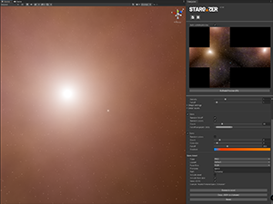

# <br>
<br>
Unity editor extension for procedually generating space skyboxes<br>

## Installation
### Manual
Add following line to `./Packages/manifest.json` under `dependencies` section:<br>
```
"com.whreality.stargazer": "https://github.com/WhReality/com.whreality.stargazer.git"
```

Example of complete `manifest.json`:
```
{
  "dependencies": {
    "com.whreality.stargazer": "https://github.com/WhReality/com.whreality.stargazer.git",
  }
}

```
### Package manager
- Select `Add package from GIT url` 
- Insert url: `https://github.com/WhReality/com.whreality.stargazer.git`


## Development
`StargazerProject` is Unity project for developing the extension.